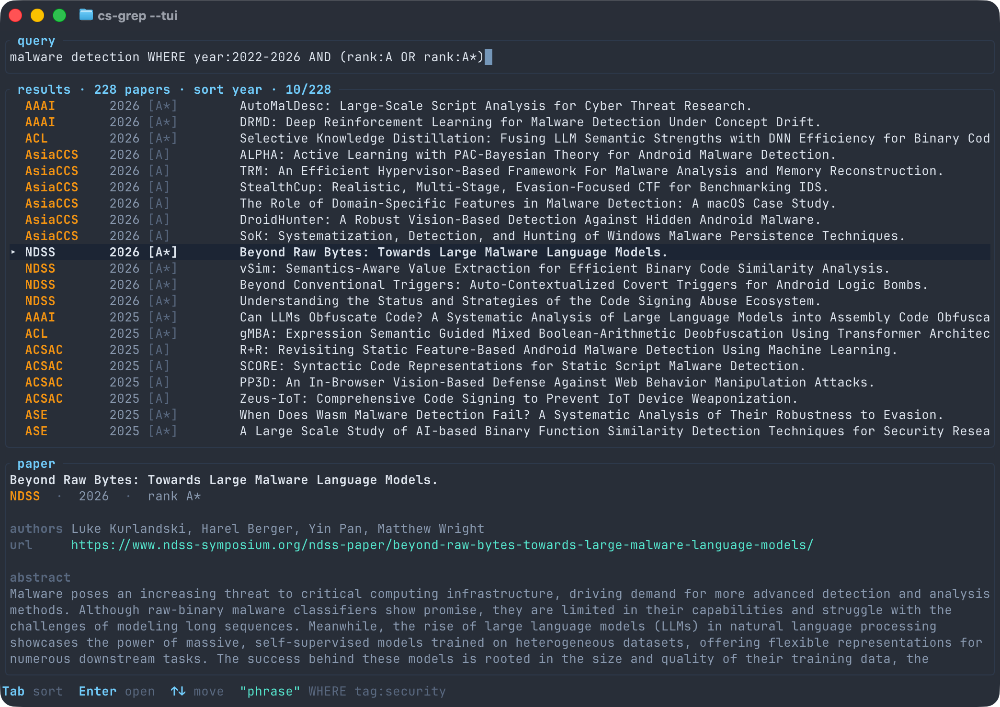

# id-grep

Fast, local search across infectious-disease ecology, evolution & epidemiology
literature.



`id-grep` builds a local SQLite/FTS5 index of paper metadata — ingested from
[OpenAlex](https://openalex.org) (primary) and [PubMed](https://www.ncbi.nlm.nih.gov/books/NBK25501/)
(complementary), with optional abstract enrichment and Zotero-aware
deduplication — and gives you a clean CLI and TUI for searching it with an
expressive query language across title, authors, abstract, venue, year, and
tag.

`id-grep` is a rebrand and re-target of [`cs-grep`](https://github.com/philippnormann/cs-grep)
away from computer-science venues and toward infectious-disease research. See
[`NOTICE`](NOTICE) for the full upstream lineage and data-source attribution.

## Install

Requires the Rust toolchain, edition 2021, rustc 1.95 or newer.

From a local checkout:

```sh
cargo install --path crates/id-grep
```

Cargo installs to `~/.cargo/bin` on macOS/Linux and
`%USERPROFILE%\.cargo\bin` on Windows. Make sure that directory is on `PATH`.

Or build with [Nix](https://nixos.org/):

```sh
nix build
```

For development, install [`just`](https://github.com/casey/just)
(`cargo install just`) to drive the build/test recipes in the `justfile`.

## Quickstart

```sh
id-grep init                              # one-time: create the DB + config
id-grep update --bundle epi --since 2020  # fetch metadata (network)
id-grep enrich                            # fill in missing abstracts (network)
id-grep 'transmission WHERE venue:Epidemics'
```

`update` and `enrich` need network access to reach OpenAlex/PubMed and the
abstract-enrichment sources. Querying an already-built index is entirely
offline.

## The catalog

Venue catalogs are grouped into bundles that `update` and `enrich` ingest
from:

| Bundle | Contents | Loaded by default? |
|---|---|---|
| `epi` | Epidemiology & clinical infectious-disease journals (e.g. JID, Lancet ID, EID, CID, AJE, IJE) | yes |
| `modelling` | Mathematical/computational epidemiology (e.g. Epidemics, PLoS Computational Biology, PLoS NTDs, Journal of Theoretical Biology) | yes |
| `ecoevo` | Disease ecology & evolution (e.g. Ecology Letters, Journal of Animal Ecology, Molecular Biology and Evolution, Virus Evolution, TREE) | yes |
| `general` | General-interest flagship journals (Nature, Science), ID-scoped | yes |
| `preprints` | bioRxiv, medRxiv | opt-in only |

Multidisciplinary venues (Nature, Science, Nature Medicine, PLOS ONE, The
American Naturalist) are scoped to infectious-disease topics at ingest, so
`update` pulls only ID-relevant works rather than the entire journal. The scope
uses the OpenAlex topic taxonomy (Infectious Diseases, Virology, Parasitology,
and Epidemiology subfields); drop `scope` on a venue to ingest everything.

Venues are keyed by ISSN (or, for preprint servers with no ISSN, an OpenAlex
source id) and resolve through PubMed's NLM journal abbreviation where
available. Each venue also ships handy short aliases you can use in queries
and on the command line, e.g. `lancet-id`, `eid`, `plos-cb`, `plos-ntd`, and
`tree`.

The bundled catalog lives in `crates/id-grep-core/venues/*.yaml`. ISSNs there
are drawn from public sources and are not independently re-verified in this
repo; if a venue returns no records on `update`, spot-check its ISSN against
OpenAlex's `/sources` endpoint.

Select a non-default combination of bundles per invocation:

```sh
id-grep update --bundle epi,modelling,preprints
id-grep enrich --bundle ecoevo
```

To add or override venues, extend the user config created by `id-grep init`:

- Linux: `~/.config/id-grep/config.yaml`
- macOS: `~/Library/Application Support/id-grep/config.yaml`
- Windows: `%APPDATA%\id-grep\config.yaml`

(Locations are resolved by the `directories` crate; pass `--config
path/to/config.yaml` to use a specific file instead.)

```yaml
bundles: [epi, modelling, ecoevo]

defaults:
  min_year: 2000

venues:
  - id: MyJournal
    name: My Custom Journal
    issn: ["0000-0000"]
    aliases: [myjournal]
    tags: [epi]
```

User venues are merged after the selected bundles by `id`: reuse an existing
`id` to override a bundled venue, or add a new `id` to extend the catalog.
Then ingest and search it:

```sh
id-grep update --venue MyJournal
id-grep 'outbreak WHERE venue:MyJournal'
```

## Query language

Queries have a full-text expression, followed by optional metadata filters
after `WHERE`:

```sh
id-grep 'text-expression WHERE metadata-filters'
```

- Text supports bare terms (implicit `AND`), `OR`, `NOT`, parentheses,
  `"quoted phrases"`, trailing prefixes such as `spillover*`, and the
  field scopes `title:`, `author:`, and `abstract:`. `*` alone matches every
  paper (use it with a `WHERE` clause).
- Metadata filters support `venue:<id|alias>`, `tag:<tag>`, `doi:<substr>`,
  and `year:` ranges (`year:2020`, `year:2018-2024`, `year:2020-`,
  `year:-2019`), combined with `AND`/`OR`/`NOT`/parentheses. Text `NOT`
  requires a positive text term; metadata filters can be negated directly.

Examples:

```sh
# Spillover/reservoir papers tagged as ecology work, since 2015
id-grep 'spillover OR reservoir WHERE tag:ecology AND year:2015-'

# A specific phrase, scoped to one venue
id-grep '"basic reproduction number" WHERE venue:Epidemics'

# Metadata-only filter: all PLoS NTD papers from 2023
id-grep '* WHERE venue:plos-ntd AND year:2023'

# Malaria papers, excluding a venue, sorted by year
id-grep 'malaria WHERE year:2020- AND NOT venue:eid' --sort year
```

Sort results with `--sort relevance` (default), `--sort year`, or
`--sort venue`. Launch the interactive TUI with `--tui` (`Tab` cycles sort
modes, arrow keys move, `Enter` opens the selected paper's URL).

## Output formats

`--format` selects the output format: `table` (default), `json`, `csv`, or
`bibtex`. Limit or choose columns with `--limit` and `--fields
venue,year,title,doi`.

```sh
id-grep 'kernel* WHERE venue:tree' --format bibtex > papers.bib
id-grep 'antimicrobial resistance WHERE year:2023-' --format json
id-grep '(spillover OR reservoir) WHERE year:2020-' --limit 20
id-grep --db ./papers.db 'symbolic epidemiology WHERE venue:AJE'
```

`--format json` prints a single, versioned envelope on stdout:

```json
{
  "schema_version": 2,
  "count": 2,
  "results": [
    {
      "key": "W123",
      "source": "openalex",
      "venue": "Epidemics",
      "year": 2021,
      "title": "…",
      "authors": "Ada Lovelace, Alan Turing",
      "doi": "10.1016/…",
      "url": "https://…",
      "abstract": "…",
      "owned": null
    }
  ]
}
```

Check `schema_version` before parsing; it only bumps on an incompatible
change. On error under `--format json`, stdout is empty and stderr carries
`{"schema_version":2,"error":"…"}` instead.

Pass `--quiet` to suppress human-readable progress/logging on stderr; results
still print on stdout. This, combined with `--format json`, is the pairing to
use when driving `id-grep` from a script or agent.

See [`CLAUDE.md`](CLAUDE.md) for the full agent-facing contract, including
exit codes (`0` success, `1` generic error, `2` CLI usage error, `3` no
results, `4` config/query error, `5` network/upstream failure).

## Zotero

Cross-reference search results against a local Zotero library — either mark
what you already own, or drop it:

```sh
id-grep --mark-owned --zotero ~/Zotero 'malaria WHERE venue:plos-ntd'    # keep everything, flag owned rows
id-grep --exclude-owned --zotero ~/Zotero 'malaria WHERE venue:plos-ntd' # drop owned rows entirely
```

`--mark-owned` keeps every result and adds an `owned` field to JSON records
(and an `owned` column, first in table/CSV output) so you can see at a
glance — and still cite — papers you already have. `--exclude-owned` drops
them instead, built on the same check. Neither flag is on by default, so a
plain query never touches Zotero.

`--zotero` defaults to `~/Zotero` if omitted. Matching is DOI-first, then
normalized title. It's safe to run this while Zotero itself is open — the
library's SQLite file is copied and opened read-only.

## Configuration & credentials

`id-grep init` creates a data directory (for `papers.db`) and a config
directory (for `config.yaml`), resolved per-OS by the `directories` crate —
see the paths listed under [The catalog](#the-catalog) above. Override either
with `--db <path>` or `--config <path>`.

No credentials are required to query an existing index. `update` and `enrich`
can use optional credentials from the environment or a local `.env` file (see
[`.env.example`](.env.example)):

| Variable | Used for |
|---|---|
| `OPENALEX_MAILTO` | Contact email for OpenAlex's polite pool (recommended) |
| `OPENALEX_API_KEY` | OpenAlex lookups |
| `NCBI_API_KEY` / `NCBI_EMAIL` | Raise PubMed/NCBI E-utilities rate limits |
| `SEMANTIC_SCHOLAR_S2_KEY` | Semantic Scholar abstract lookups |
| `OPENREVIEW_USERNAME` / `OPENREVIEW_PASSWORD` | Dormant OpenReview source, unused by the default catalog |

`.env` is loaded automatically when present.

## Development

```sh
just check   # fmt-check + clippy (-D warnings) + the offline test suite
```

Network-dependent tests are `#[ignore]`d so `just check`/`just test` stay
offline and deterministic; run them explicitly with `cargo test --
--ignored` where OpenAlex/NCBI are reachable. See the `justfile` for other
recipes (`just build`, `just run`, `just update <bundle>`, `just enrich`).

## Credits & attribution

- `id-grep` is derived from [`cs-grep`](https://github.com/philippnormann/cs-grep)
  by Philipp Normann; see [`NOTICE`](NOTICE) for the full lineage.
- Data sources: [OpenAlex](https://openalex.org) and
  [PubMed](https://www.ncbi.nlm.nih.gov/books/NBK25501/) for ingestion;
  [Crossref](https://www.crossref.org) and
  [Semantic Scholar](https://www.semanticscholar.org) for abstract
  enrichment. Please respect each provider's terms of use and rate limits.

## License

Released under the [MIT License](LICENSE).
